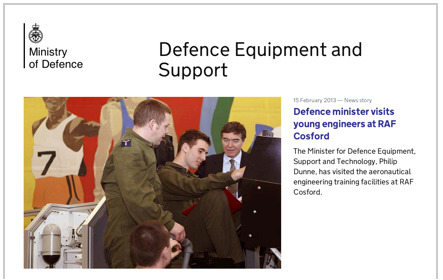
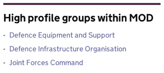
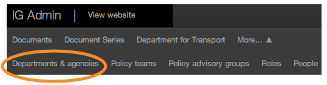
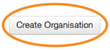
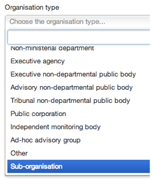
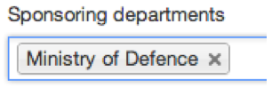

Please note this manual is a draft version and will be revised shortly.

# Sub-organisations

Sub-orgs are high profile groups that have sufficient public profile and publishing activity to warrant a presence, nested beneath a parent body. The sub-org will have a normal organisation homepage which can have its own corporate content and featured stories. However it will not be available for tagging. 

It will appear at the bottom of the sponsoring organisation's homepage under ‘High profile groups’.

Please check with GDS before using this type. Once you have agreement, you can create the sub-org.

* First click on ‘Departments and agencies’.

* Click on the ‘Create organisation’ button.

* Select the organisation type, 'Sub-organisation'.

* Set the sponsoring department to your organisation.

	 

Any sub-org will go live as soon as you save the page. So double check everything before you click ‘Save’. You can then find it in the departments and agencies list (use ctrl F to find it quickly) and you can add corporate content and featured stories exactly as with an [organisation home page](http://alphagov.github.io/inside-government-admin-guide/organisations-groups/organisation-home-page.html).

[< Back to contents](alphagov.github.io/inside-government-admin-guide/)

