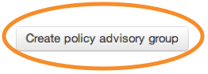

##Team

A team is a group within an organisation responsible for a particular area. For example, the [high speed rail team](https://www.gov.uk/government/policy-teams/high-speed-rail-team).

It appears as a link in the metadata on the policy and in the top tab for the department/agency.

To create one, first click on 'Teams' under the 'More' button on the top menu.

Then click on ‘Create team’.

Enter the name, email address and description of the team.

Any changes you make to these pages will go live as soon as you save them. So double check everything before you click ‘Save’.

To associate a team with a policy, go into the policy and select the team you've created from the menu under 'Who's working on this?'.

## Policy advisory group

Policy advisory groups are groups or committees that have input to a policy. You can include a description, contact details and attached meeting papers. 

Policy advisory groups are often but not always made up of external experts or stakeholders. Members are not modelled as people and roles, just listed in the description or in an attached file.

To create one, first click on ‘Policy advisory groups’.
	

Then click on ‘Create policy advisory group’.


Enter the name, email address, summary and description of the group. Add any attachments.

Any changes you make to these pages will go live as soon as you save them. So double check everything before you click ‘Save’.


Go to the policy page where you would like to add the group, then click ‘Edit’.

Scroll down to ‘Who’s working on this?’ and pick the group you want. When you’re done click ‘Save’.

	
Preview the page and you’ll see there’s a link to the policy advisory group’s page.



## Governance group

Use governance groups to show memberships of the top level boards and committees within your organisation. 

To create one, click on your organisation name.
	

	
Then click on ‘Governance groups’.

You can add, edit or delete groups.

Groups can only be deleted if they have no members

Add a name, description and members.

Any changes made to these pages will go live as soon as you save them. So double check everything before you click ‘Save’.

You need to link to these pages as they’re not surfaced anywhere at present.

