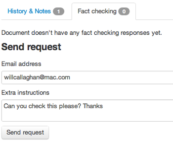
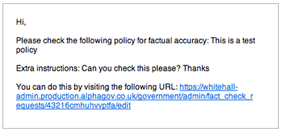
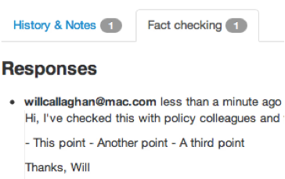

Please note this manual is a draft version and will be revised shortly.

# Fact checking, sharing pages with colleagues

We’ve made it easy for you to share documents with colleagues who don’t have access to the Publisher. You can use this to allow people to comment on documents before they go live. To send things to multiple colleagues you'll need to send separate fact checking requests.

Click the ‘Fact checking’ tab on the right of any document and write a message to your colleague. Include the GOV.UK general access password - they will need this to get past the security that stops the public seeing these preview pages.

Your colleague will receive an email with a link to click.

This link takes them to a version of your page where they can leave comments.

When they've checked the page, you'll receive an email with a link to click. 

This link takes you back to the Publisher where you can see their comments.

[< Back to contents](http://alphagov.github.io/inside-government-admin-guide)
