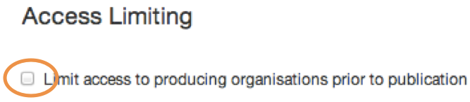

## Limiting access

You can restrict access to selected documents. Please only use this if the information is confidential.

	
When you tick this box, the document you're creating can only be edited and published by colleagues from departments it’s associated to (both lead and supporting departments). Once the document is published, it can be accessed by anyone.

[< Back to contents](http://alphagov.github.io/inside-government-admin-guide.html)
