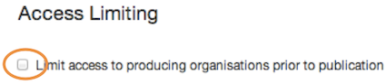

## Limiting access

1. You can restrict access to selected documents.

	
	
	By checking this box, the document you're creating can only be edited and published by colleagues from departments it’s associated to (both lead and supporting departments).

	Once the document is published, it can be accessed by anyone.