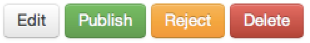
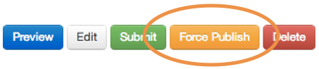
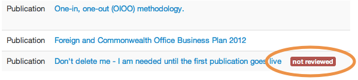
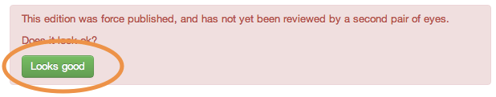

## Second pair of eyes, force publishing and ‘looks good’

Once a document is ready to be published and has no further amendments outstanding, it should be taken out of draft status and submitted for a second person to check against the [Style guide](https://www.gov.uk/designprinciples/styleguide) and for other errors. 

Click the ‘Submit’ button and the content moves to the submitted documents list.

Another editor can then edit, publish or reject it.

When your document is either published (or rejected) you will be notified by email. A rejected document reverts to draft status and after further editing you can submit it to the second eye once again.

###Force publishing

In certain cases (eg when a document must be published urgently and no other editor is available to carry out the second eye), an editor can publish it immediately using the 'Force publish' button. You'll have to give a valid reason why you're force-publishing. GDS is monitoring the frequency of force publishing, and the reasons given. It should never be used as a matter of course.

Force-published content is flagged with a red 'Not reviewed' label and should be checked by a second pair of eyes as soon as possible.

To clear this label, ask a fellow editor to check the page and click the ‘Looks good’ button. This is a retrospective second pair of eyes on the document and it will no longer count as force-published.

[< Back to contents](http://alphagov.github.io/inside-government-admin-guide)

