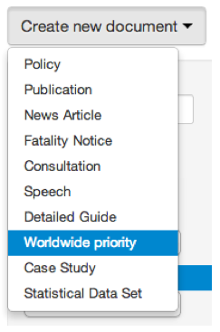
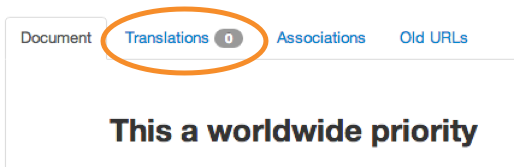
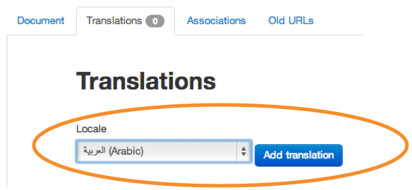
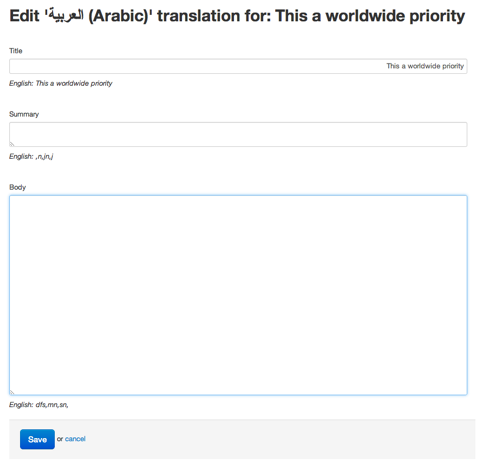
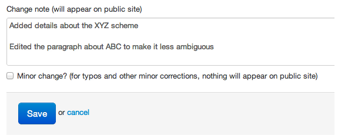
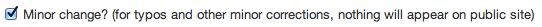

## Translating docs

1. It’s possible to add translations for many documents around the site.

	[Create a document](/inside-government-admin-guide/creating-documents/creating-a-new-doc.html) as normal.
	
	
	
2. Enter any text, images and attachments you need then save it.

	
	
3. Once the document is saved, you can add as many translations as you like.

	Click on the ‘Translations’ tab.

	
	
	Pick a locale and click the ‘Add translation’ button.
	
	
	
4. Add a translated title, summary and body copy then save your document.

	
	
5. When you’re done, submit to second pair of eyes.

	
	
6. When you change the content within a document, make sure you describe what you’ve done in the ‘Change note’ field.

	If you change the translated version, add a change note to the English version.
	
	Enter something short but useful, beginning with a past tense verb.
	
	
	
7. If the change is minor (eg fixing a typo or a style correction) then click the ‘Minor change’ box.

	