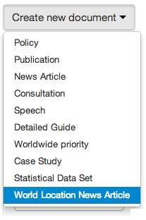
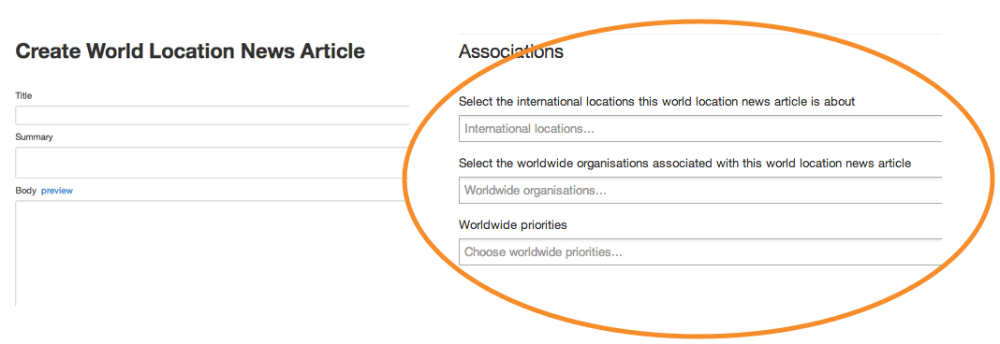

## World location news article

Use the ‘World location news article’ if you want a story to appear in your location and NOT on your main department site.

This document type is very similar to a regular news article, except it contains worldwide associations not UK ones

[More on creating documents](http://alphagov.github.io/inside-government-admin-guide/creating-documents/create-a-new-doc.html)

[< Back to contents](http://alphagov.github.io/inside-government-admin-guide/)
