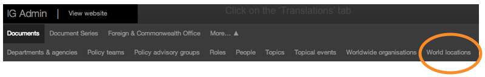
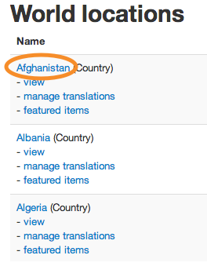
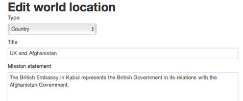
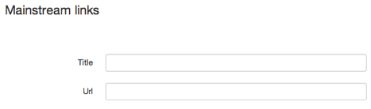
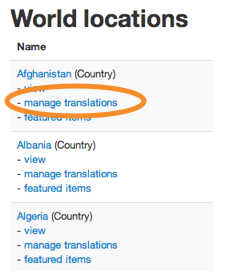
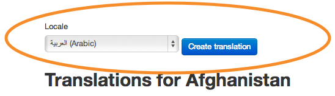
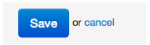
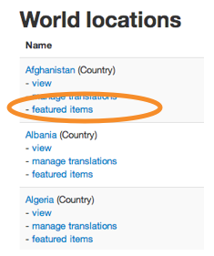
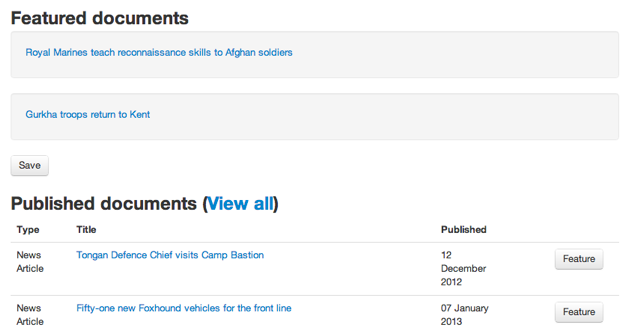

Please note this manual is a draft version and will be revised shortly.

# World locations

You can’t create World locations, but you can edit them.

Click ‘World locations’ to see a list.

Click on a location to edit content, add translations and feature documents on the location home page. 

* Don't change the title  this should always be ‘UK and...’ unless agreed with GDS.
* Type or paste in content as needed - look at the Foreign & Commonwealth Office guidance when editing the ‘Mission statement’ content.

* Add links to GOV.UK that your users might want to visit - these will appear top right on the location home page.

Any changes made to these pages will go live as soon as you save them. So double check everything before you click ‘Save’.

After saving, you can add or edit the translated version.

* Click the ‘Manage translations’ link.

* Pick a locale and click the ‘Add translation’ button.

* Save the translation when you’re done.

You can feature any document on the location page.

* Click on the ‘featured items’ link.

* Click on the ‘Feature’ button to show on the location page. Click on ‘Unfeature’ to remove it.

