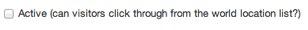

## World locations

1. You can’t create World locations, but you can edit them.

	Click ‘World locations’ to see a list.

	
	
2. The World locations list allows you to edit content in each location, add translations and feature documents at the top of each location page.

	Click the location name to edit its content.
	
	
	
3. Add content as needed.

	Title should always be ‘UK and...’ unless agreed with GDS.
	
	Please refer to the style guide for ‘Mission statement’ content.
	
	
	
	Click the 'active' checkbox to make the page visible on the site.
	
	
	
	Mainstream links appear top right on the location page.
	
	
	
	Any changes made to these pages will go live as soon as you save them. So double check everything before you click ‘Save’.
	
4. Add translations as needed.

	Click the ‘Manage translations’ link.
	
	
	
	Then pick a locale and click the ‘Add translation’ button.
	
	
	
	Save the translation when you’re done.
	
	
	
5. You can feature any document on the location page.

	Click on the ‘featured items’ link.
	
	
	
6. Click on the ‘Feature’ button to show on the location page. Click on ‘Unfeature’ to remove it.

	