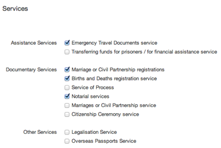

## Worldwide organisations

You can create Worldwide organisations and edit them.

* Click 'More' then click on ‘Worldwide organisations’ to see a list.

* Click on the title to edit an organisation.
* Before creating a new organisation, check it doesn't exist - you can use CTRL F to search the list.
* If you need to create one, click on the ‘Create Worldwide organisation’ button.

* Add or edit content as needed.

Any changes made to these pages will go live as soon as you save them. So double check everything before you click ‘Save’.

### Add or edit translations

* Click on the organistion.
* Click on the ‘Translations’ tab.
* Open translations to edit them or create a new translation by clicking the 'Create translation' button.

### Add or edit contact information and social media

* Click on the name of your organisation.

* Click on the 'Offices' tab to add or edit contact details.

* FCO should specify an office type from the drop down menu. Other organisations should select ‘Other’.

* FCO should tick the services provided by that office, if any.

* Phone number fields should contain numbers, nothing else.

* Click on 'Access and opening times' to add or edit these details.
* Click on 'Social media accounts' to add or edit social media details.
	

### Corporate information pages 

* Click on the name of your organisation.

* Click on the 'Corporate information pages' tab.
* Click on the page name to edit the page.
* To create a new page, pick a page type and enter content as needed.

You can only use each page once. Remember to save when you’re done.
