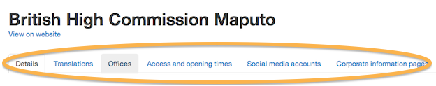
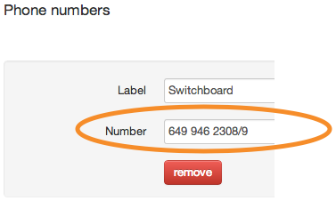

## Worldwide organisations

1. You can create Worldwide organisations and edit them.

	Click ‘Worldwide organisations’ to see a list.
	
	
	
	Click on ‘Create Worldwide organisation’.
	
	
	
2. Add content as needed.

	Any changes made to these pages will go live as soon as you save them. So double check everything before you click ‘Save’.
	
	
	
3. Add translations as needed.

	Click on ‘Manage translations’.

	
	
	Pick a locale and click the ‘Add translation’ button.
	
	
	
5. Add more information as needed.

	Click on the name of your organisation.
	
	
	
	Click on these tabs to add more info.
	
	
	
6. Add, edit or delete contact info.

	
	
7. FCO should specify an office type from the drop down menu. Other organisations should select ‘Other’.

	
	
8. FCO should check services provided by that office, if any.

	
	
9. Phone number fields should contain numbers, nothing else.

	
	
10. Add, edit or delete soclal media accounts.

	
	
11. Add corporate info pages as needed.

	Click to add a new page.

	
	
12. Pick a page type and enter content as needed.

	You can only use each page once.
	
	Remember to save when you’re done.
	
	