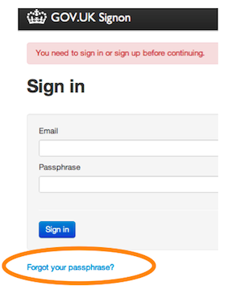
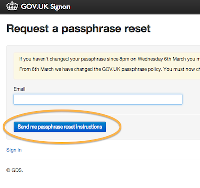

Please note this manual is a draft version and will be revised shortly.

## Forgot your passphrase

There is a simple passphrase reset request on the login screen. It is also useful if you can't find your welcome email and want to get started.

* Go to the Preview (practice/mock-ups) or Production (live) environment, depending on which one you’ve forgotten the passphrase for.

   * [https://signon.preview.alphagov.co.uk](https://signon.preview.alphagov.co.uk)
   * [https://signon.production.alphagov.co.uk](https://signon.production.alphagov.co.uk)

* You should be prompted for the GOV.UK username and password. This is NOT your personal username and password but the one that's the same for all users.

   

* Next click the 'Forgot your passphrase?' link (clicking more than once will delay your access to Publisher).

   

* Finally enter the email address you signed up to GOV.UK with and click the blue button. 

   

Password reset instructions will be sent to the email address if it is registered with us. If you can't find them, check your spam filter.

Some IT departments block these emails so that's also worth checking.

[< Back to contents](http://alphagov.github.io/inside-government-admin-guide/)
