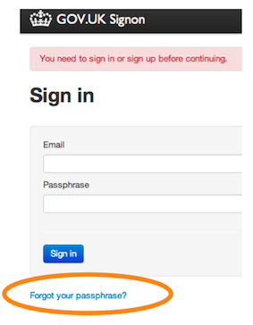
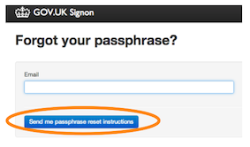

## Forgot your password?

1. Go to the Preview or Production environment, depending on which one you’ve forgotten the password for.

   [https://signon.preview.alphagov.co.uk](https://signon.preview.alphagov.co.uk)

   [https://signon.production.alphagov.co.uk](https://signon.production.alphagov.co.uk)

2. You may be prompted for the ‘betademo’ username and password.

   Username: betademo
   Password: -----

   

3. Next click the "Forgot your passphrase?"
link.

   

4. Finally enter the email address you signed up to GOV.UK with and click the blue button. Password reset instructions will be sent to the email address you entered.

   