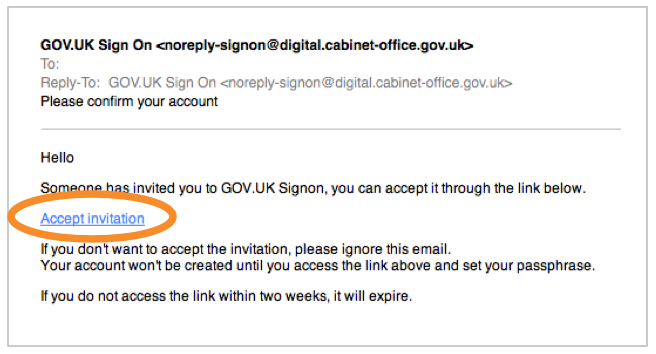
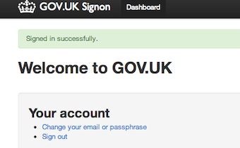
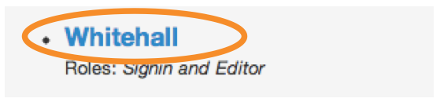
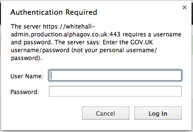

## Activate your account

We have 2 separate environments, Production and Preview, and you need to create a login on each. Ask GDS to create the accounts by filling in the [support form](https://www.gov.uk/support/internal). You’ll receive 2 emails inviting you to create these accounts.

* Click on the 'Accept invitation' link in each email and follow the steps below for each account.

* Use Preview if you’re practising (all content on Preview is overwritten every week, so it is not a good place to create any documents you wish to keep.)
* Use Production if you are creating content to go live.   
* If you have not received an email, check your spam/junk folder. 
* If you still can't find it but believe that you have been registered, follow the steps for [forgot passphrase](http://alphagov.github.io/inside-government-admin-guide/your-account/forgot-your-passphrase.html) to trigger an email. 
* Set a passphrase that’s strong but memorable.

* When your passphrase is set you’ll see a green confirmation message.

* Click on 'Whitehall' - this is the part of Publisher where all government content is created and edited. 

* You will be prompted for the password that you have been given (it's the same for all users).

If it is your first time in Publisher, you’ll be asked to confirm we can use your email account. Just click ‘Authorise’ and you’re ready to go.

## Types of account

Department and agency web editors will generally be given 'editor' status. If you don't publish content and will use Publisher only for writing and editing copy, you will be a 'writer' status. This means you won't be able to publish content, but you will be able to carry out [second eye](http://alphagov.github.io/inside-government-admin-guide/workflow-content/second-pair-of-eyes.html).

Your manager will tell GDS which type of account you need. 

## Requesting an account

If you don't have an account and you need one, ask your manager to contact [GDS support](https://support.production.alphagov.co.uk/) (you need to be logged in to access the support form). You'll need to be in a department or agency that has already transitioned to GOV.UK or is about to do so.

----------------------------------------------------------------------------------------------------------------

Find out [how to use your dashboard](http://alphagov.github.io/inside-government-admin-guide/first-steps/your-dashboard.html).
