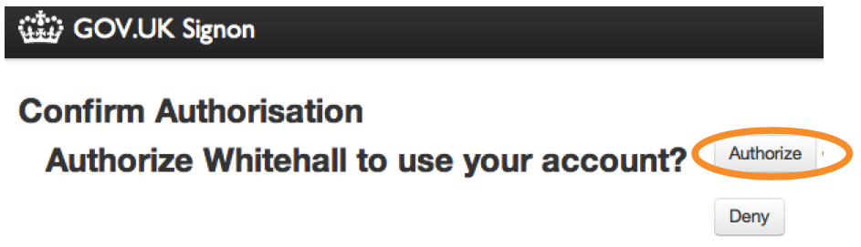

## Get an account

We have 2 separate environments, Production and Preview, and you need to create an account on each.

* You'll receive 2 emails inviting you to create these accounts.
* Click on the 'Accept invitation' link in each email and follow the steps below for each account.

   
   
If you have not received an email, check your spam/junk folder. If you still can't find it but believe that you have been registered, follow the steps for [forgot passphrase](http://alphagov.github.io/inside-government-admin-guide/your-account/forgot-your-passphrase.html) to trigger an email. 
   
* Set a passphrase that’s strong but memorable.

   

* When your passphrase is set you’ll see a green confirmation message.

   
   
* Click on 'Whitehall' - this is the part of Publisher where all government content is created and edited. 

   
   
* You will be prompted for the ‘betademo’ username and password that you have been given (the same for all users).

   Username: betademo
   
   Password: -----

   

* If it is your first time in Publisher, you’ll be asked to confirm we can use your email account. 
* Just click ‘Authorise’ and you’re ready to go.

   
