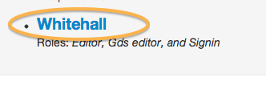

## Activate your account

We have 2 separate environments, Production and Preview, and you need to create a login on each. GDS has to set up these accounts for you. Once this is done, you’ll receive 2 emails inviting you to activate these accounts. You will also receive an email from GDS explaining in detail how to set up your passphrases and get access to Publisher.

* Click on the 'Accept invitation' link in each email and follow the steps below for each account.

* Use Preview if you’re practising (all content on Preview is overwritten every week, so it is not a good place to create any documents you wish to keep.)
* Use Production if you are creating content to go live.   
* If you have not received an email, check your spam/junk folder. 
* If you still can't find it but you have been registered, follow the steps for [forgot passphrase](http://alphagov.github.io/inside-government-admin-guide/your-account/forgot-your-passphrase.html) to trigger an email. 
* Set a passphrase that’s strong but memorable.

* When your passphrase is set you’ll see a green confirmation message.

* Click on 'Whitehall' - this is the part of Publisher where all government content is created and edited. 

* You will be prompted for the general password that you have been given (it's the same for all users, not your personal email-based login). 

If it is your first time in Publisher, you’ll be asked to confirm we can use your email account. Just click ‘Authorise’ and you’re ready to go.

## Types of account

With 'writer' status you can create content. 'Editor' status means you can create and publish content and will be able to carry out [second eye](http://alphagov.github.io/inside-government-admin-guide/workflow-content/second-pair-of-eyes.html) checks on content submitted by others.

Your manager will tell GDS which type of account you need. 

## Requesting an account

If you don't have an account and you need one, ask your manager to contact GDS support by using the form at [https://support.production.alphagov.co.uk/](https://support.production.alphagov.co.uk/) (you need to be logged in to access the support form). You'll need to be in a department or agency that has already transitioned to GOV.UK or is about to do so. You will need to attend a training session on writing to GOV.UK style and using Publisher before being granted an account.

## Your dashboard

Logging in takes you to your dashboard. Find out [how to use your dashboard](http://alphagov.github.io/inside-government-admin-guide/first-steps/your-dashboard.html). 
