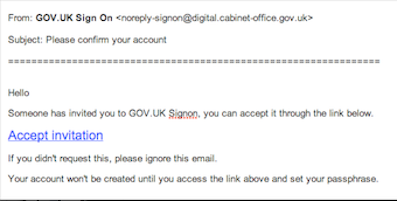
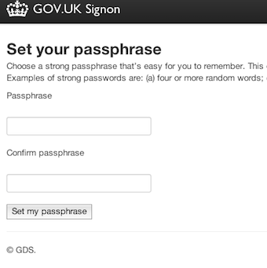

## Get an account

We have two separate environments, called Production and Preview, and you need to create an account on each.

You'll receive two emails inviting you to create these accounts.

Next, set a password that’s strong but memorable.

When your password is set you’ll see a green confirmation message.

Scroll down to the foot of the page and click on the 'Whitehall' link. Whitehall is the name of our publishing tool.

You may be prompted for the ‘betademo’ username and password. Use the following…

Username: betademo
Password: -----

As it’s your first time here, you’ll be asked if Whitehall can use your GOV.UK account.

Just click ‘Authorize’ and you’re ready to go.

