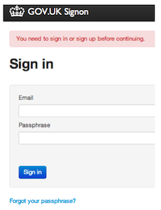

## Logging in

We have 2 separate environments in Publisher.

* Use Preview if you're practising - [https://signon.preview.alphagov.co.uk](https://signon.preview.alphagov.co.uk)
* Use Production if you want the content to go live - [https://signon.production.alphagov.co.uk](https://signon.production.alphagov.co.uk)

All content on Preview is overwritten every week, so it is not a good place to create any documents you wish to keep.

* You should be prompted for the ‘betademo’ username and password (same for all users).

   
   
* Next enter your your official government email address and your chosen passphrase.

   
  
* Click on 'Whitehall', which is the home of government content on Publisher.

   
