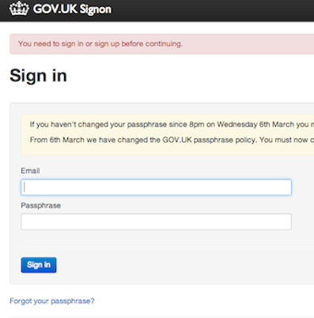

## Logging in

We have 2 separate environments in Publisher.

* Use Preview if you're practising - [https://signon.preview.alphagov.co.uk](https://signon.preview.alphagov.co.uk)
* Use Production if you want the content to go live - [https://signon.production.alphagov.co.uk](https://signon.production.alphagov.co.uk)

Content will not be copied from Preview to Production under any circumstances, so please check where you’re creating new content.

* You should be prompted for the ‘betademo’ username and password (same for all users).

   
   
* Next enter your your official government email address email and password for the environment you’re working on, either Preview or Production.

   
  
* Click on 'Dashboard' to access the most useful content for your account.

